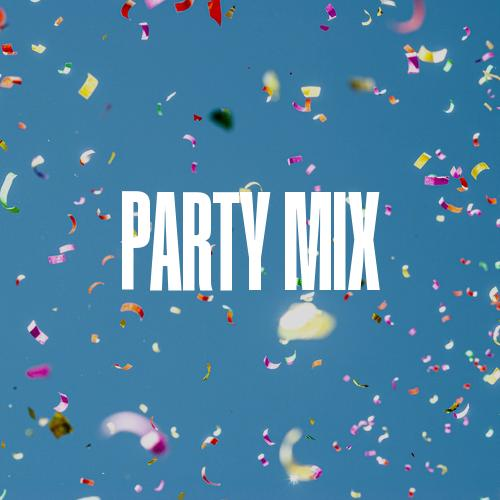

# playlist-cover-generator
Python script to generate and upload Spotify playlist cover images through the Spotify API with user-given images.

### About
It allows you to create playlist covers based on your created playlists by matching the playlist name and an jpeg image located in the `src` subfolder with the same filename as the playlist.

You can create all covers in batch, or select individual playlists.
The script allows you to upload them to your Spotify profile automatically based on playlist IDs.
Also, you can turn all playlist names to uppercase as a stylistic choice.

### Examples
|   

### How to use 
In development. Script looks for environmental variables of Spotipy, more info at [spotipy.readthedocs.io](https://spotipy.readthedocs.io/en/master/)
You need to export these variables:
```
export SPOTIPY_CLIENT_ID='your-spotify-client-id'
export SPOTIPY_CLIENT_SECRET='your-spotify-client-secret'
export SPOTIPY_REDIRECT_URI='your-app-redirect-url'
```
from your application created on [developer.spotify.com](https://developer.spotify.com/dashboard/login).

You also need the Humane font, which can be donwloaded from Béhance [here](https://www.behance.net/gallery/146747487/HUMANE-Free-Typeface-Variable), or replaced in the source code for any other font. Thin, tall fonts work the best in my opinion.
